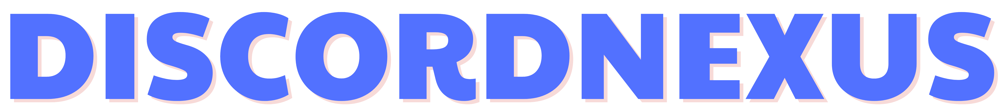

	 
	

		
	

	 
	

		
		
		
		
	

## Stargazers over time

## DiscordNexus
This is a software for Discord.js bot with highly customisable

## Features
- **Plugin API**: improve bots effectively
- **Updated frequently**: We develop DiscordNexus every day to create a perfect software

## Getting Started
- [Documentation](https://discordnexus.readthedocs.io/)
- [Installation instructions](https://discordnexus.readthedocs.io/en/latest/usage.html#installation)
- [Docker image](https://github.com/dnexusjs/DiscordNexus/pkgs/container/discordnexus)

## Support Us
First of all, thank you for considering helping out, we really appreciate that!

You can support development using the following methods:
- [Patreon](https://www.patreon.com/discordnexusjs)
- Bitcoin (BTC): `bc1q63mh5aqrs0yglfju0gk72nyqaaeky9ajkdxtg4`
- ETH: `0xB612bDb14e9b0E1aa58156783b3000b44C191E30`

Thanks for your support!

## Sponsors

[JetBrains](https://www.jetbrains.com/), creators of the IntelliJ IDEA, supports Paper with one of their [Open Source Licenses](https://www.jetbrains.com/opensource/). IntelliJ IDEA is the recommended IDE for working with Paper, and most of the Paper team uses it.

## License
Licensed under the [GNU General Public License v3.0](https://github.com/dnexusjs/DiscordNexus/blob/master/LICENSE) license.